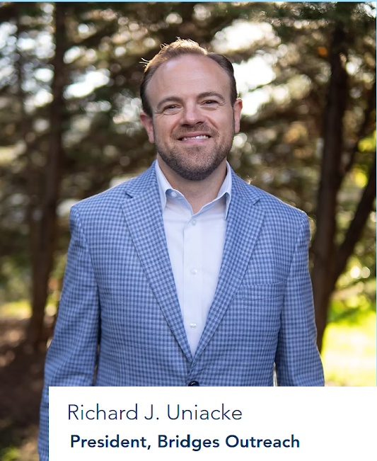

On August 25, 2025 Mayor Dave Siedell and Commissioner Frank Troy introduced a law that could jail homeless people for sleeping outside. 

### The Public Comment Period — Official Video

A five-hour public comment period ensued after the introduction of this proposed law. The official recording of that meeting can be viewed [here](https://www.youtube.com/watch?v=SjO2hV16Anc&ab_channel=BoroughofHaddonfield).

Despite overwhelming rejection by Haddonfield residents and warnings from experts that the law would expose Haddonfield to costly lawsuits and worsen the burdens on homeless people, Mayor Siedell and Commissioner Troy voted to advance the law.

### News Links

If you would like to read Matt Skoufalos's article in NJPen, it can be found [here](https://www.njpen.com/haddonfield-advances-anti-homelessness-ordinance-over-objections-of-packed-forum/).

If you would like to reach Inquirer's reporting on the ordinance, it can be found [here](https://www.inquirer.com/crime/haddonfield-homeless-outdoor-sleeping-ban-20250827.html).

### A Bad Look for Haddonfield

At the August 25 meeting, Richard Uniacke, president of Bridges Outreach, a nonprofit that connects homeless people with resources and wrap-around services, spoke extensively against the law proposed by Mayor Siedell and Commissioner Troy.

|  |
|:--:|
| *Richard Uniacke, President, Bridges Outreach* |

Uniacke stated that Haddonfield has 31 students that qualify for free and reduced price lunch. "These are families living on the edge. What would you have them do if someone should face housing insecurity or homelessness?"

Uniacke added: "In New Jersey it costs approximately $75,000 to incarcerate a human, where as it costs on average $12,050 to rapidly house a two-person household for a year."

Uniacke informed the Commissioners that "Heading down the path of institutionalization and incarceration is not just wrong, it’s not just a bad look, it’s also not cost-effective."

### Costly Litigation for Haddonfield?

Jeff Wild, litigation partner at Lowenstein Sandler, and trustee at NJ Coalition to End Homelesness said at the Augst 25 Haddonfield Commisioners’ Meeting:

|  |
|:--:|
| *Jeff Wild, Esq.* |

"The right answer to ending homelessness is to help people find housing. And there is absolutely no need for Haddonfield to enact an ordinance that can be used to fine, or put unhoused people in jail. The Board should table this proposed ordinance which I submit is illegal under New Jersey law."

### Repeating the Mistakes of Other Towns

Summit, New Jersey already introduced a similar law that was [later withdrawn after public outcry](https://gothamist.com/news/wealthy-nj-city-rethinks-law-that-could-jail-homeless-people-after-public-outcry).

The entire debacle resulted in a black eye for the town. Why are Mayor Siedell and Commissioner Troy making the same mistake for Haddonfield?

|  |
|:--:|
| Mayor Dave Siedell (left), Commissioner Itir Cole (center), Commissioner Frank Troy (right) |

Despite a five hour public comment period wherein 25 Haddonfield residents opposed the law, 20 of our non-resident neighbors also opposed the law, and only 3 Haddonfield residents supported the law, Mayor Siedell and Commissioner Troy voted the amendments forward. 

At the August 25 meeting, Commissioner Cole stated the following. (All quotes were pulled from the official recording of the August 25 Commissioners' Meeting by a human transcriber; no AI was used in the creation of this information page.)

> I am telling you now this was not me. In fact, I argued against this the entire time that this was being debated. So no, this was not the borough commissioners. I want nothing to do with this.

> I can tell from having observed the process in which this ordinance came to be. It is not rooted in research. It is not rooted in data or stats. It is not rooted in any moral code. So what does that leave behind? Political ideology? I don't know. But I can tell you what it is not rooted in.

> I've heard two approaches. Approach 1: Send the police let the police deal with this. This ordinance essentially will make sleeping outside a municipal level crime, which means our police will have to deal with it. But if you ask anyone who has done any research on this or has studied it, that does not work.
>
> They're going to go to jail because they're not going to be able to pay this fine.
>
> Jail is not stable housing so they're going to end up back right on the street. We haven't solved anything. And we pay the county for that.
>
> The other approach is a tried a proven approach. By the way the criminalization has been what we've been doing for decades and doesn't work. The other tried and proven approach, is meet people in their moment of need. Don't send a police officer with a gun, send a social worker, send a specialist who actually is trained in this, and can meet that person, build a relationship, build trust, earn that relationship and eventually lead them to stable housing with the wrap around services that will keep them stably housed. 
>
> Do we want to send our police in, who get two modules every two years on training on this? Or do we send specially trained mental health specialists maybe in partnership with the police, so that it is actually dealt with in an effective way? I think if we go about it this way, people are going to end up in a position that is worse than anything else.

> I reached out to the county social services team, I reached out to the state social services team. I reached out to neighboring municipalities to talk about this and whether or not we can do any direct service program. I spoke to our faith leaders. In fact I spoke to a representative from the council of churches. I also spoke to nonprofits. I sat in on workshops. I put in a lot of hours to this. I feel quite well informed on what will work and what will not work. 
> 
> A social worker that is a town resource would be an incredible way to solve this and it would be Haddonfield being a leader. And we don't even have to hire the person. Our council of churches have offered-- and they pooled the money themselves --- have offered to hire --- and we would just have to support them. And maybe help subsidize and help find an office space for that person downtown. Let them build a relationship, keep track of the folks who we need to find housing for.

> Selective enforcement is going to be a huge problem. You're leaving interpreting this ordinance to the police officer who is responding to the situation. Selective enforcement means discrimination. That is a lawsuit.
